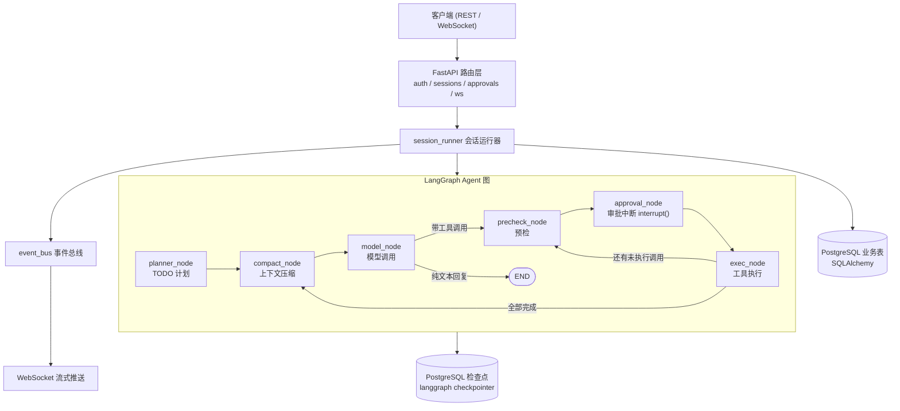
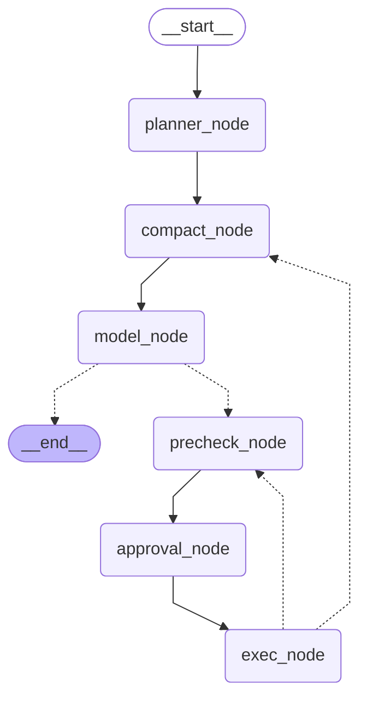

# Lumi

[](https://github.com/Cahido137/lumi/actions/workflows/ci.yml)
[](https://www.python.org/)
[](https://github.com/astral-sh/uv)
[](https://github.com/astral-sh/ruff)
[](https://opensource.org/licenses/MIT)

Lumi 是一个基于 LangGraph 的对话式 Agent 后端。高危工具调用(执行 shell 命令、写入文件)不会被直接执行, 而是先中断图执行并生成审批单, 经人工批准后方继续运行; 对话过程通过 WebSocket 推送流式事件, 上下文接近上限时自动压缩。  
项目提供基于 Docker Compose 的部署与 GitHub Actions 持续集成。

## 目录

- [功能概览](#功能概览)
- [系统架构](#系统架构)
- [Agent 图结构](#agent-图结构)
- [技术栈](#技术栈)
- [项目结构](#项目结构)
- [快速开始](#快速开始)
- [本地开发](#本地开发)
- [API 概览](#api-概览)
- [设计决策](#设计决策)
- [未来规划](#未来规划)

## 功能概览

- **用户系统**: 注册 / 登录 / JWT 鉴权
- **会话管理**: 创建、列表、消息历史、重试、打断
- **Human-in-the-loop 审批**: `run_shell`、`write_file` 等高危工具先落库为审批单, 批准后方执行, 每一步均有记录
- **工具集**: shell、文件读写、HTTP GET、网络搜索、计算器、时间、TODO 标记
- **上下文管理**: 超过阈值自动压缩, 并提供手动压缩与用量查询接口
- **双通道交互**: REST 提供阻塞式接口, 契约简单, 便于测试; WebSocket 负责推送 token / 审批 / 计划等实时事件
- **工程化**: uv 依赖锁定、ruff + mypy + pytest、Docker Compose、GitHub Actions CI

## 系统架构



## Agent 图结构



本图由编译后的 LangGraph 图导出, 可通过以下命令重新生成:

```bash
cd backend
uv run python -c "from app.core.graph.builder import build_agent_graph; print(build_agent_graph().get_graph().draw_mermaid())"
```

## 技术栈

| 领域 | 选型 |
| --- | --- |
| Web 框架 | FastAPI(REST + WebSocket) |
| Agent 编排 | LangGraph + 官方 Postgres checkpointer |
| ORM / 迁移 | SQLAlchemy 2 (async) + asyncpg + Alembic |
| 数据库 | PostgreSQL 16 |
| 配置 / 校验 | pydantic-settings |
| 依赖管理 | uv + pyproject.toml + uv.lock |
| 质量 | ruff (lint / format) + mypy (类型) + pytest (单测 / E2E) |
| 部署 | Docker Compose |
| CI | GitHub Actions |

## 项目结构

```
lumi/
├── .github/workflows/ci.yml    # CI: lint / format / 类型 / 测试
├── docker-compose.yml          # postgres + backend 编排
└── backend/
    ├── app/
    │   ├── main.py             # FastAPI 入口与 lifespan
    │   ├── config.py           # pydantic-settings 配置项
    │   ├── routers/            # REST / WS 路由
    │   ├── crud/               # 数据库 CRUD
    │   ├── db/                 # ORM 模型与会话
    │   ├── schemas/            # 请求 / 响应模型与枚举
    │   ├── core/
    │   │   ├── graph/          # LangGraph 图结构与各节点
    │   │   ├── session_runner/ # 图执行、流处理、审批恢复
    │   │   └── tools/          # 工具实现
    │   └── utils/
    ├── alembic/                # 数据库迁移
    └── tests/                  # 单测 + E2E 测试
```

## 快速开始

前提条件:

- Docker + Docker Compose
- 一个可用的 OpenAI 兼容模型 API

步骤:

1. 复制配置样例并填入模型密钥:

```bash
cp backend/.env.example backend/.env
```

2. 启动 (首次运行会构建镜像, 自动建库并执行迁移):

```bash
docker compose up --build -d
```

3. 打开 FastAPI 交互文档: http://localhost:8000/docs

## 本地开发

```bash
# 1) 启动数据库 (在仓库根目录执行)
docker compose up -d postgres

# 2) 安装依赖并配置 (在 backend/ 目录执行)
cd backend
uv sync
cp .env.example .env

# 3) 迁移并启动
uv run alembic upgrade head
uv run uvicorn app.main:app --reload
```

代码质量检查:

```bash
uv run ruff check .
uv run ruff format --check .
uv run mypy app
uv run pytest -q    # 需要 127.0.0.1:5432 上有可用的 PostgreSQL 服务
```

重新生成图结构并本地预览:

```bash
uv run python -c "from app.core.graph.builder import build_agent_graph; print(build_agent_graph().get_graph().draw_mermaid())" > /tmp/lumi_graph.mmd
npx -y --registry=https://registry.npmmirror.com @mermaid-js/mermaid-cli -i /tmp/lumi_graph.mmd -o /tmp/lumi_graph.png -b white
```

## API 概览

启动后完整交互文档见 http://localhost:8000/docs 。

| 前缀 | 职责 |
| --- | --- |
| `/api/auth` | 注册 / 登录 / 当前用户 |
| `/api/sessions` | 会话管理、聊天、消息历史、重试、打断、上下文压缩与用量 |
| `/api/approvals` | 审批决定(批准 / 拒绝) |
| `/api/ws/{session_id}` | WebSocket 事件流(JWT 通过 query 参数 `token` 传递) |

## 设计决策

1. **业务数据与图状态分离存储**: 用户 / 会话 / 消息 / 审批单 / 工具执行记录 / todos 存储于 SQLAlchemy 业务表, 便于 SQL 查询与业务扩展; 图的中间状态与对话断点交由 LangGraph 官方 Postgres checkpointer 管理, 支持中断后从断点恢复执行。业务表承担"回看历史"的职责, 检查点承担"恢复执行"的职责, 两者边界清晰, 不做混用。
2. **基于图中断实现的审批**: `approval_node` 调用 LangGraph 的 `interrupt()` 暂停图执行, 将高危工具调用落库为 pending 审批单, 接口返回"等待审批"; 用户作出决定后, 通过 `Command(resume=...)` 从断点恢复执行。审批单与执行记录分表存储, 状态机为 pending → approved / rejected、pending → success / error, 每一步状态流转均可追溯。
3. **上下文自动压缩**: 每次调用模型前检查本轮输入 token 数: 超过警告阈值(默认 0.6)时推送警告事件; 超过压缩阈值(默认 0.75)时自动总结历史对话, 摘要落库, 仅保留近期消息, 避免长对话超出上下文窗口。
4. **REST 阻塞 + WebSocket 流式**: `/api/sessions/{id}/chat` 阻塞至本轮结束方返回, 接口契约简单, 便于测试; token 流、审批事件、计划事件等实时数据通过 WebSocket 传输, 由 event_bus 统一分发。此为有意的设计取舍: 阻塞接口保证简单与可测试性, 流式通道保证实时性。

## 未来规划

- [ ] 项目级工作区: 绑定项目文件夹作为会话工作目录
- [ ] 多设备协作: 同一账号跨设备执行工具
- [ ] 全双工语音交互
- [ ] Live2D 形象接入 (与语音流同步)
